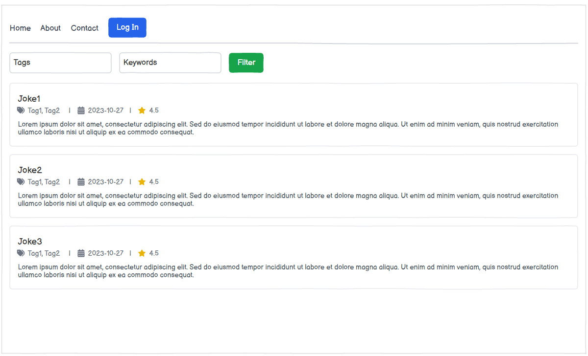
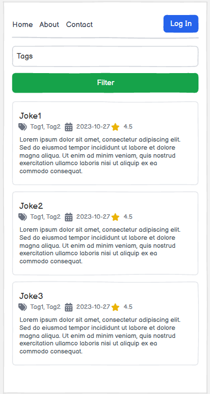

# Table of Contents

- [0 Глоссарий](#0-глоссарий)

- [1 Введение](#1-введение)
  - [1.1 Назначение](#11-назначение)
  - [1.2 Бизнес-требования](#12-бизнес-требования)
    - [1.2.1 Исходные данные](#121-исходные-данные)
    - [1.2.2 Возможности бизнеса](#122-возможности-бизнеса)
    - [1.2.3 Границы проекта](#123-границы-проекта)

- [2 Требования пользователя](#2-требования-пользователя)
  - [2.1 Программные интерфейсы](#21-программные-интерфейсы)
  - [2.2 Интерфейс пользователя](#22-интерфейс-пользователя)
  - [2.3 Характеристики пользователей](#23-характеристики-пользователей)
  - [2.4 Предположения и зависимости](#24-предположения-и-зависимости)

- [3 Системные требования](#3-системные-требования)
  - [3.1 Функциональные требования](#31-функциональные-требования)
    - [3.1.1 Просмотр списка анекдотов](#311-просмотр-списка-анекдотов)
    - [3.1.2 Поиск анекдотов](#312-поиск-анекдотов)
    - [3.1.3 Фильтрация анекдотов](#313-фильтрация-анекдотов)
    - [3.1.4 Сортировка анекдотов](#314-сортировка-анекдотов)
    - [3.1.5 Получение случайного анекдота](#315-получение-случайного-анекдота)
    - [3.1.6 Работа с тегами](#316-работа-с-тегами)
    - [3.1.7 Добавление и редактирование анекдотов](#317-добавление-и-редактирование-анекдотов)
    - [3.1.8 Работа Telegram-бота](#318-работа-telegram-бота)
    - [3.1.9 Поиск дубликатов](#319-поиск-дубликатов)

  - [3.2 Нефункциональные требования](#32-нефункциональные-требования)
    - [3.2.1 Атрибуты качества](#321-атрибуты-качества)
      - [3.2.1.1 Комфортный пользовательский интерфейс](#3211-комфортный-пользовательский-интерфейс)
      - [3.2.1.2 Требования к удобству использования](#3212-требования-к-удобству-использования)
      - [3.2.1.3 Требования к надёжности](#3213-требования-к-надёжности)
      - [3.2.1.4 Внешние интерфейсы](#3214-внешние-интерфейсы)

## 0 Глоссарий
- 1 Анекдот — текстовая запись юмористического содержания, отображаемая и хранящаяся в системе.
- 2 Тег — ключевое слово или категория, связанная с анекдотом и используемая для поиска и фильтрации.
- 3 Пользователь — человек, взаимодействующий с системой через веб-интерфейс или Telegram-бота.
- 4 Авторизованный пользователь — пользователь, имеющий возможность добавлять и редактировать анекдоты.
- 5 Telegram-бот — программный интерфейс в мессенджере Telegram, предоставляющий доступ к функциям системы.

## 1 Введение

### 1.1 Назначение

Данный документ содержит требования к программному изделию «JokeHub», предназначенному для хранения, поиска, редактирования и просмотра анекдотов через веб-интерфейс и Telegram-бота. Документ предназначен для команды, выполняющей разработку, тестирование и сопровождение проекта.
Система предоставляет пользователю возможность просматривать коллекцию анекдотов, выполнять поиск по тексту, фильтровать анекдоты по тегам и дате, получать случайные анекдоты, а также взаимодействовать с системой через Telegram-бота.

### 1.2 Бизнес-требования

#### 1.2.1 Исходные данные

Пользователи развлекательных интернет-ресурсов часто сталкиваются с проблемами поиска интересного контента среди большого количества однотипных или повторяющихся записей. Во многих существующих решениях отсутствует удобная система тегов, поиска и персонализированного взаимодействия с контентом.
Кроме того, коллекции анекдотов зачастую содержат дубликаты, плохо структурированы и не позволяют удобно управлять содержимым.

#### 1.2.2 Возможности бизнеса

Создание веб-приложения «JokeHub» позволит:
- организовать централизованное хранилище анекдотов;
- обеспечить быстрый поиск и фильтрацию контента;
- автоматически классифицировать анекдоты по тегам;
- предоставить возможность добавления и редактирования анекдотов;
- реализовать простую систему пользователей;
- обеспечить доступ к коллекции анекдотов через Telegram-бота;
- реализовать получение случайных анекдотов по тегу;
- улучшить пользовательский опыт за счёт бесконечной прокрутки и удобного интерфейса;
- реализовать механизм поиска похожих и дублирующихся анекдотов на основе текстового и векторного сравнения. 
Приложение может использоваться как развлекательная платформа, а также как экспериментальный проект по обработке текстовых данных и семантическому поиску.

#### 1.2.3 Границы проекта

Приложение «JokeHub» позволит пользователям:
- просматривать список анекдотов;
- выполнять поиск по тексту;
- фильтровать анекдоты по тегам и дате;
- получать случайный анекдот;
- сортировать записи по рейтингу, дате или случайным образом;
- просматривать связанные теги;
- добавлять и редактировать анекдоты;
- использовать Telegram-бота для получения случайных анекдотов;
- автоматически определять дубликаты анекдотов.

Приложение не предусматривает:
- сложную систему ролей и прав доступа;
- социальные функции (личные сообщения, подписки, комментарии);
- полноценную рекомендательную систему;
- мультимедийный контент;
- сложную систему модерации.

## 2 Требования пользователя

### 2.1 Программные интерфейсы

Приложение предназначено для работы в среде операционных систем Windows и Linux. Веб-приложение должно функционировать через современные браузеры с поддержкой HTML5, CSS3 и JavaScript.
Для реализации системы используются следующие программные средства и библиотеки:
- язык программирования Python;
- веб-фреймворк FastAPI;
- шаблонизатор Jinja2;
- система управления базами данных PostgreSQL;
- расширение pgvector для хранения и поиска векторных представлений текста;
- библиотека psycopg2 для взаимодействия с PostgreSQL;
- Telegram Bot API для взаимодействия с Telegram-ботом;
- JavaScript для реализации динамической загрузки контента (infinite scroll). 

Система взаимодействует с базой данных PostgreSQL для хранения анекдотов, тегов, пользователей и оценок.

### 2.2 Интерфейс пользователя

Система предоставляет пользователю веб-интерфейс для просмотра и поиска анекдотов, а также Telegram-бота для быстрого получения случайных анекдотов.
Главная страница приложения содержит:
- список анекдотов;
- форму поиска и фильтрации;
- элементы сортировки;
- кнопку получения случайного анекдота;
- теги, отображаемые под каждым анекдотом. 

Пользователь может выполнять поиск анекдотов, по ключевым словам, фильтровать записи по тегам и дате, а также сортировать анекдоты по рейтингу, дате или случайным образом. При прокрутке страницы новые анекдоты подгружаются автоматически без перезагрузки страницы.
Теги отображаются в виде выделенных элементов интерфейса и позволяют быстро перейти к просмотру анекдотов соответствующей тематики.
Telegram-бот предоставляет пользователю возможность:
- получать случайный анекдот;
- получать случайный анекдот по указанному тегу;
- просматривать доступные теги. 

### 2.3 Характеристики пользователей

Целевой аудиторией проекта являются пользователи средней и старшей возрастной категории, обладающие базовым уровнем технической грамотности.
Система ориентирована на несколько групп пользователей:
- обычные пользователи, просматривающие развлекательный контент;
- пользователи Telegram, взаимодействующие с ботом;
- администраторы, добавляющие и редактирующие анекдоты и теги. 

Для работы с системой не требуется специальных технических знаний или профессиональной подготовки.

### 2.4 Предположения и зависимости

Для корректной работы системы предполагается наличие подключения к сети Интернет и установленной системы PostgreSQL.
Работа Telegram-бота зависит от доступности Telegram API. Корректное отображение интерфейса и динамическая загрузка контента требуют поддержки JavaScript в браузере пользователя.
Система ориентирована преимущественно на работу с текстами на русском языке и не предусматривает полноценную поддержку других языков.

## 3 Системные требования

### 3.1 Функциональные требования

Работа приложения осуществляется через веб-интерфейс и Telegram-бота. Система должна обеспечивать хранение, поиск, фильтрацию и отображение анекдотов.

#### 3.1.1 Просмотр списка анекдотов.

Пользователь должен иметь возможность просматривать список анекдотов через веб-интерфейс. Анекдоты отображаются в виде списка с текстом, рейтингом, датой и связанными тегами.

#### 3.1.2 Поиск анекдотов.

Пользователь должен иметь возможность выполнять поиск анекдотов по ключевым словам. Система должна отображать анекдоты, текст которых содержит введённый запрос.

#### 3.1.3 Фильтрация анекдотов.

Система должна предоставлять возможность фильтрации анекдотов:
- по тегам;
- по дате;
- по поисковой строке.

#### 3.1.4 Сортировка анекдотов.

Пользователь должен иметь возможность сортировать анекдоты:
- по рейтингу;
- по дате;
- случайным образом.

#### 3.1.5 Получение случайного анекдота.

Система должна предоставлять возможность получения случайного анекдота через веб-интерфейс и Telegram-бота.

#### 3.1.6 Работа с тегами.

Под каждым анекдотом должен отображаться список связанных тегов. Пользователь должен иметь возможность перейти к просмотру анекдотов по выбранному тегу.

#### 3.1.7 Добавление и редактирование анекдотов.

Авторизованный пользователь должен иметь возможность добавлять и редактировать новые анекдоты в систему.
#### 3.1.8 Работа Telegram-бота.

Telegram-бот должен обеспечивать выполнение следующих функций:
- получение случайного анекдота;
- получение случайного анекдота по тегу;
- отображение списка доступных тегов.

#### 3.1.9 Поиск дубликатов.

Система должна автоматически определять похожие и дублирующиеся анекдоты на основе текстового и векторного сравнения.

### 3.2 Нефункциональные требования

#### 3.2.1 Атрибуты качества

##### 3.2.1.1 Комфортный пользовательский интерфейс.

Система должна иметь минималистичный интерфейс, позволяющий пользователю сосредоточиться на чтении текста.

##### 3.2.1.2 Требования к удобству использования

Интерфейс приложения должен быть простым и понятным для пользователя с базовым уровнем технической грамотности.
Элементы интерфейса должны иметь однозначные названия и визуально отличаться от фона страницы.
Теги должны отображаться в виде отдельных визуально выделенных элементов.

##### 3.2.1.3 Требования к надёжности

Система должна обеспечивать сохранность данных при добавлении и редактировании анекдотов.
Ошибки сервера не должны приводить к повреждению базы данных или потере пользовательских данных.

##### 3.2.1.4 Внешние интерфейсы

Веб-интерфейс должен корректно отображаться в современных браузерах.
Telegram-бот должен взаимодействовать с пользователем через Telegram Bot API.
Интерфейс приложения должен поддерживать корректное отображение текста на русском языке, включая кириллицу и специальные символы.
